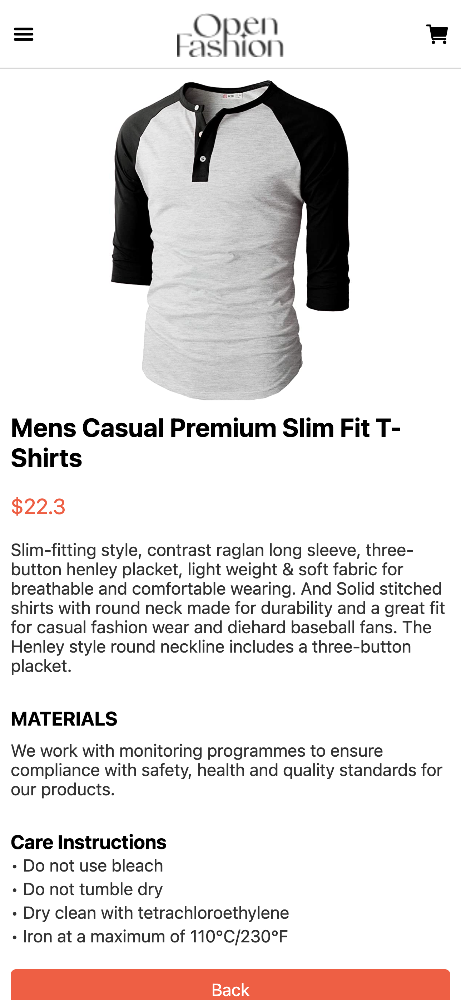
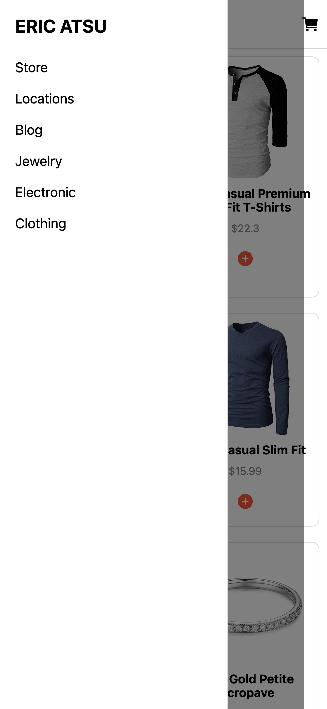
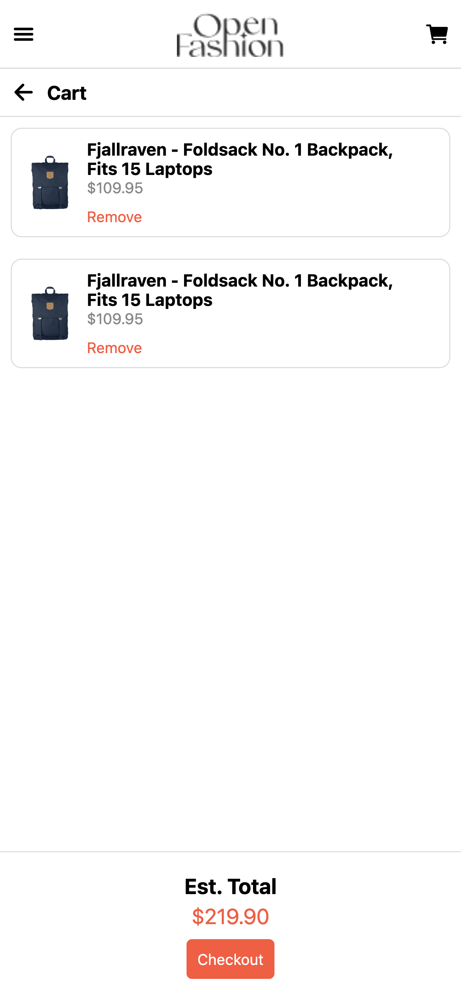
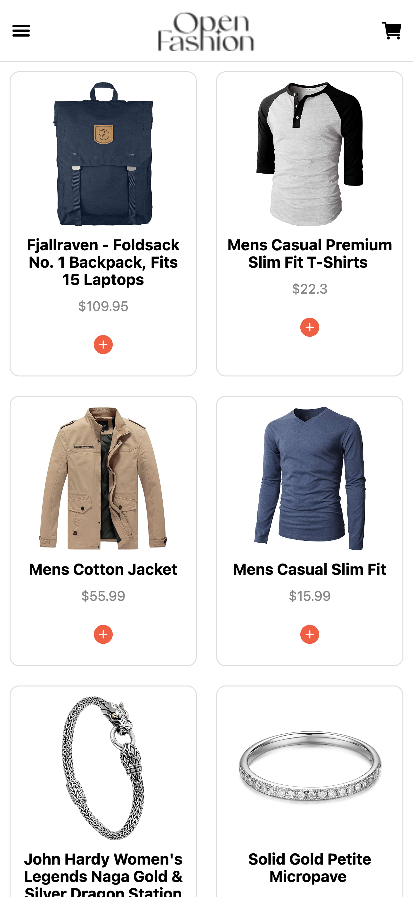

# README

## DCIT202 ASSIGNMENT 7

### Overview

This project is a simple e-commerce mobile application built with React Native. It allows users to view a list of products fetched from an external API, view detailed information about each product, add products to their cart, and view and remove items from their cart. The application utilizes local storage to persist cart data, ensuring that the cart items remain available even if the app is closed and reopened.

### Features

- **HomeScreen**: Displays a list of available products fetched from an external API.
- **ProductDetailScreen**: Displays detailed information about a selected product.
- **CartScreen**: Displays selected items that have been added to the cart.
- **Drawer Component**: Accessible through a swipe gesture or a button, providing navigation options.
- **Add to Cart Button**: Available for each product in the list and in the product detail view.
- **Remove from Cart Button**: Available for each selected item in the cart.
- **Local Storage**: Uses AsyncStorage to store selected items locally on the device.

### Design Choices

1. **Navigation**: Utilized React Navigation to handle the navigation between different screens. A stack navigator was used for navigating between the HomeScreen, ProductDetailScreen, and CartScreen. A drawer navigator was implemented to provide a swipeable menu for additional navigation options.
  
2. **State Management**: Used React hooks (`useState` and `useEffect`) for managing the component state. The useEffect hook was particularly useful for fetching data from the API and loading cart items from local storage.

3. **Local Storage**: Chose AsyncStorage for local storage due to its simplicity and ease of use. AsyncStorage allows us to store key-value pairs and retrieve them asynchronously, which is perfect for persisting cart items.

4. **UI Components**: Leveraged built-in React Native components (View, Text, FlatList, TouchableOpacity, Image) and community-driven libraries (React Navigation, Ionicons) to build a responsive and interactive UI.

### Implementation Details

- **Fetching Data**: Data is fetched from the external API using the fetch function. This is done in an asynchronous manner using async/await to handle the promises.
  
- **Rendering Product Lists and Details**: The product list is rendered using FlatList, which is efficient for displaying large lists. Each product item has an "Add to Cart" button that adds the item to the cart and saves it in AsyncStorage. The ProductDetailScreen provides more information about the product and also includes an "Add to Cart" button.

- **Cart Management**: The cart is managed using state, and items are persisted using AsyncStorage. When an item is added to the cart, it is saved in AsyncStorage. The CartScreen retrieves the saved items and displays them. Users can remove items from the cart, which updates both the state and AsyncStorage.

### Screenshots

